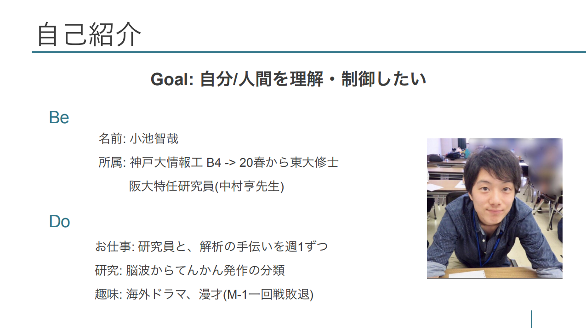
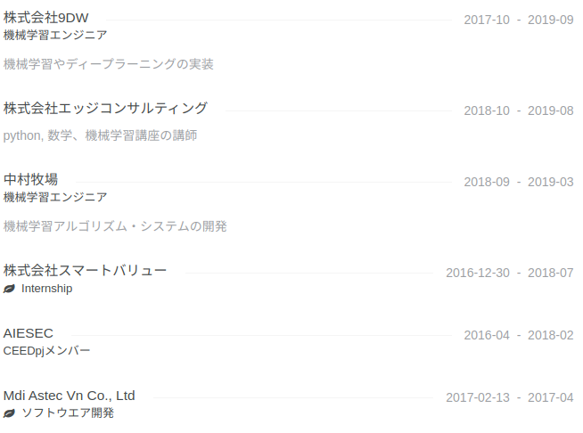

# Tomoya Koike's Portfolio(WIP)

## 内容
- 自己紹介
- 仕事の経歴
- 研究の経歴
- その他の経歴
- 各種媒体
- 個人的ストーリーと今の目標

---

---

## 仕事の経歴
ここでお伝えしたいのは、「ちゃんと継続して仕事ができる人間です」ということです。\
コードが書ける人間なのかは[github](https://github.com/Tomoya-K-0504)をご覧ください。

#### 以下、折りたたみで詳細

株式会社9DW

2018年末までアルバイト、2019年は業務委託で、主に機械学習のプロジェクトのエンジニアをしていました。

関わったプロジェクトというかテーマは、競馬、料理画像認識、音声認識、FXです。競馬、FX共にコアのアルゴリズムを作る部分を担いましたが、精度が上がりきらず商用まではもっていけませんでした。\
音声認識では、ディープラーニング等近年の音声認識のリサーチと、識別精度向上のための言語モデルの構築等をしていました。

株式会社エッジコンサルティング

[Python+数学講座](https://www.aijobcolle.com/py/)の講師、[機械学習講座](https://www.aijobcolle.com/ml/)の講師をしていました。\
講座の修了テストでは、他の時期の講座と比べて受講生平均が高く、講師として良い評価を運営の方から頂きました。

## 研究の経歴
ここでお伝えしたいのは、「真面目に研究やってる人間です」ということです。\
現在は卒論の他に2つ、進学先の東大のPhDの方と進めている研究があります。
どちらも来年の6月頃publishされる予定です。

## その他の経歴
- ABEJAさんで5日間インターンして心電計を作りました。
- AIESECに大学1~2年のとき所属していました。結局2年間で1ヶ月ミャンマーで営業したり、ベトナムのIT企業で2ヶ月インターンしたり、9人のチームリーダーやって全然成果出せなかったりしました。このときはひたすらやりたいことを模索してました。

## 各種媒体
- [Twitter](https://twitter.com/makeffort050)
- [Facebook](https://www.facebook.com/profile.php?id=100011704921338)
- [github](https://github.com/Tomoya-K-0504)
- [google scholar(まだpublishは0です)](https://scholar.google.com/citations?hl=en&user=GOTsYQaVMesC)
- [wantedly](https://www.wantedly.com/users/26447173)
- [Linkedin](https://www.linkedin.com/in/tomoya-koike-015365153/)

## 個人的ストーリーと今の目標
### 自分のできることに集中したい
人生色々ありますが、「できることは全部やる」ことが納得いく人生送るのに大事かなと思っています。\
中高サッカーをやっていたときも、「足を速くするのはできないこと。できることは最高のコンディションで試合に臨むこと。」とか考えていました。\
大学に入っても「自分にできることは何か」を考えている中で、**「どこまでの自分は変えられて、どこからは変えられないのだろう」**と思うようになり、その理解のために生体信号に興味を持ち始めました。

### 社会への価値発揮のために、自分のできること
仕事や研究等の、自身の価値発揮について、考えていることを書きます。
まず意識していることは以下です。
1. 約束を守る。誠実さ。
2. 目標に対して自己管理を最適化すること
3. 専門的能力の拡大
